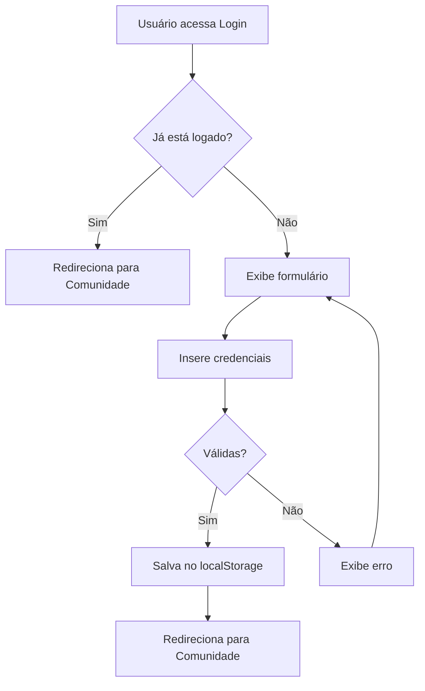

# 👥 Página de Comunidade - JADUC

## 🎯 Visão Geral

Página web interativa de feed social comunitário com sistema de autenticação integrado. Permite que moradores de Pimentas, Guarulhos - SP se conectem, compartilhem informações e participem de discussões locais.

## ✨ Funcionalidades

### 🔐 Sistema de Autenticação
- ✅ Login com validação de credenciais
- ✅ Proteção de rota (requer autenticação)
- ✅ Redirecionamento automático após login
- ✅ Persistência de sessão com localStorage
- ✅ Logout funcional
- ✅ Verificação de sessão ao carregar páginas

### 📱 Feed Social
- ✅ Posts da comunidade com informações completas
- ✅ Avatar e perfil do usuário
- ✅ Localização e timestamp dinâmico
- ✅ Categorias: Voluntariado, Debate, Meu Bairro
- ✅ Sistema de filtros por categoria
- ✅ Expandir/recolher conteúdo ("Leia mais")

### 💬 Interações Sociais
- ✅ Curtir posts (contador dinâmico)
- ✅ Comentar posts (placeholder para futura implementação)
- ✅ Animações de feedback visual
- ✅ Timestamps atualizados automaticamente

### 🎨 Design e UX
- ✅ Interface consistente com páginas existentes
- ✅ Animações suaves e micro-interações
- ✅ Responsivo (Desktop, Tablet, Mobile)
- ✅ Acessível (WCAG 2.1 AA)
- ✅ Header compartilhado entre páginas

## 🔑 Credenciais de Teste

Para acessar a página de comunidade, use as seguintes credenciais na página de login:

```
Email: usuario@jaduc.com
Senha: jaduc2026
```

## 🚀 Como Usar

### Fluxo de Autenticação

1. **Acesse a Página de Login**
   ```
   Jaduc/Página de Login e Cadastro/index.html
   ```

2. **Insira as Credenciais**
   - Email: `usuario@jaduc.com`
   - Senha: `jaduc2026`

3. **Clique em "Entrar na comunidade"**
   - Sistema valida as credenciais
   - Salva sessão no localStorage
   - Redireciona automaticamente para a Comunidade

4. **Navegue Livremente**
   - Acesse Comunidade e Transparência
   - Sessão permanece ativa
   - Use o botão de logout quando necessário

### Navegação Entre Páginas

```
Login → Comunidade ⇄ Transparência
  ↓
Logout → Login
```

## 📁 Estrutura de Arquivos

```
Página de Comunidade/
├── index.html          # Estrutura HTML completa
├── globals.css         # Variáveis CSS e estilos globais
├── style.css           # Estilos específicos da página
├── script.js           # Autenticação e interatividade
└── README.md           # Esta documentação
```

## 🎨 Componentes Principais

### 1. Header Compartilhado
```html
<header class="main-header">
    <!-- Logo, navegação, perfil do usuário -->
</header>
```
- Reutilizável em todas as páginas
- Navegação ativa destacada
- Menu dropdown do usuário
- Menu hambúrguer (mobile)

### 2. Filtros de Categoria
```html
<section class="filters-section">
    <button class="filter-btn filter-btn--active" data-filter="all">
        Todas as ações
    </button>
    <!-- Mais filtros... -->
</section>
```
- Filtros: Todas as ações, Meu Bairro, Voluntariados, Debates
- Animação de transição suave
- Estado ativo visual

### 3. Post Card
```html
<article class="post-card" data-category="voluntariado">
    <div class="post-header">
        <!-- Avatar, nome, localização, timestamp -->
    </div>
    <div class="post-content">
        <!-- Título, texto, "Leia mais" -->
    </div>
    <div class="post-footer">
        <!-- Curtir, comentar -->
    </div>
</article>
```

## 🔧 Funcionalidades JavaScript

### Autenticação

```javascript
// Verificar se está logado
function checkAuthentication() {
    const user = JSON.parse(localStorage.getItem('jaducUser'));
    if (!user || !user.isAuthenticated) {
        window.location.href = '../Página de Login e Cadastro/index.html';
    }
    return user;
}

// Fazer logout
function logout() {
    localStorage.removeItem('jaducUser');
    window.location.href = '../Página de Login e Cadastro/index.html';
}
```

### Filtros

```javascript
// Filtrar posts por categoria
function filterPosts(filter, posts) {
    posts.forEach(post => {
        const category = post.dataset.category;
        if (filter === 'all' || category === filter) {
            post.classList.remove('hidden');
        } else {
            post.classList.add('hidden');
        }
    });
}
```

### Interações

```javascript
// Curtir post
likeBtn.addEventListener('click', () => {
    const counter = btn.querySelector('.like-count');
    const currentCount = parseInt(counter.textContent);
    
    if (btn.classList.contains('liked')) {
        counter.textContent = currentCount - 1;
        btn.classList.remove('liked');
    } else {
        counter.textContent = currentCount + 1;
        btn.classList.add('liked');
    }
});
```

## 🎭 Animações

### Entrada dos Posts
```css
@keyframes slideInUp {
    from {
        opacity: 0;
        transform: translateY(30px);
    }
    to {
        opacity: 1;
        transform: translateY(0);
    }
}

.post-card {
    animation: slideInUp 0.5s ease backwards;
}
```

### Feedback de Curtida
```css
@keyframes heartBeat {
    0%, 100% { transform: scale(1); }
    25% { transform: scale(1.3); }
    50% { transform: scale(1.1); }
}

.like-btn.liked {
    animation: heartBeat 0.5s ease;
}
```

## 📱 Responsividade

### Breakpoints

| Dispositivo | Largura | Ajustes |
|------------|---------|---------|
| Desktop | 1600px+ | Layout completo |
| Laptop | 1440px | Espaçamentos reduzidos |
| Tablet | 1024px | Grid adaptado |
| Mobile | 768px | Stack vertical, menu hambúrguer |
| Mobile Pequeno | 480px | Tipografia otimizada |

### Adaptações Mobile

- Menu de navegação em overlay
- Filtros em coluna vertical
- Posts full-width
- Avatares menores
- Tipografia escalada
- Touch-friendly (botões maiores)

## 🔐 Sistema de Autenticação

### Estrutura de Dados do Usuário

```javascript
const userData = {
    isAuthenticated: true,
    username: "Usuario",
    email: "usuario@jaduc.com",
    location: "Pimentas, Guarulhos - SP",
    loginTime: 1726348800000
};
```

### Fluxo de Autenticação



### Proteção de Rotas

Todas as páginas autenticadas verificam a sessão:

```javascript
// No início do script.js
const user = checkAuthentication();
if (!user) {
    // Redireciona para login
    return;
}
```

## 🎨 Paleta de Cores

```css
/* Cores do Projeto JADUC */
--bg-page: #f8ede5           /* Fundo bege */
--primary-blue: #003d5c      /* Azul escuro */
--primary-dark: #016180      /* Azul principal */
--accent-blue: #4a8cb0       /* Azul claro */
--teal-light: #9ecdc9        /* Verde-azulado */
--brown-dark: #4c2c17        /* Marrom escuro */
--brown-medium: #8c5c47      /* Marrom médio */
--brown-light: #a17a6a       /* Marrom claro */
--white: #ffffff             /* Branco */
```

## ♿ Acessibilidade

### Recursos Implementados

- ✅ Semântica HTML5 (`<article>`, `<section>`, `<nav>`)
- ✅ ARIA labels para botões e interações
- ✅ Alt text para avatares e ícones
- ✅ Contraste adequado (WCAG AA)
- ✅ Navegação por teclado funcional
- ✅ Focus visível em elementos interativos
- ✅ Screen reader friendly

### Navegação por Teclado

- `Tab`: Navegar entre elementos
- `Enter/Space`: Ativar botões
- `Esc`: Fechar menus (se implementado)

## 🌐 Compatibilidade

### Navegadores Suportados

- ✅ Chrome 90+
- ✅ Firefox 88+
- ✅ Safari 14+
- ✅ Edge 90+
- ✅ Opera 76+

### Tecnologias Utilizadas

- HTML5 (Semântico)
- CSS3 (Grid, Flexbox, Custom Properties, Animations)
- JavaScript ES6+ (Vanilla, sem frameworks)
- localStorage API
- SVG (Ícones inline)

## 🔄 Integração com Outras Páginas

### Página de Login

**Modificações realizadas:**

1. **Verificação de sessão existente**
   ```javascript
   // Redireciona se já estiver logado
   checkExistingAuth();
   ```

2. **Validação de credenciais**
   ```javascript
   // Valida email e senha
   validateLogin(email, password);
   ```

3. **Redirecionamento após login**
   ```javascript
   // Salva sessão e redireciona
   localStorage.setItem('jaducUser', JSON.stringify(userData));
   window.location.href = '../Página de Comunidade/index.html';
   ```

4. **Mensagem de erro visual**
   ```javascript
   // Exibe erro com animação
   showError('Email ou senha incorretos');
   ```

### Página de Transparência

**Navegação:**
- Link no header para Comunidade
- Link no header para Transparência
- Sessão mantida entre páginas

## 🐛 Troubleshooting

### Problema: Não consigo fazer login

**Solução**: Verifique se está usando as credenciais corretas:
- Email: `usuario@jaduc.com`
- Senha: `jaduc2026`

### Problema: Redirecionado para login ao acessar comunidade

**Solução**: Isso é esperado se não estiver autenticado. Faça login primeiro.

### Problema: Sessão não persiste

**Solução**: Verifique se o localStorage está habilitado no navegador.

### Problema: Filtros não funcionam

**Solução**: Verifique o console do navegador para erros JavaScript.

### Problema: Timestamps não atualizam

**Solução**: Os timestamps atualizam a cada 30 segundos automaticamente.

## 🚀 Futuras Melhorias

### Sugestões de Expansão

- [ ] Integração com backend real (API REST)
- [ ] Sistema de comentários completo
- [ ] Upload de imagens nos posts
- [ ] Notificações em tempo real
- [ ] Sistema de mensagens diretas
- [ ] Perfil de usuário editável
- [ ] Busca de posts e usuários
- [ ] Moderação de conteúdo
- [ ] Gamificação (badges, pontos)
- [ ] PWA (Progressive Web App)
- [ ] Modo escuro (dark mode)
- [ ] Compartilhamento em redes sociais
- [ ] Geolocalização de posts
- [ ] Eventos da comunidade

## 📊 Métricas de Performance

### Otimizações Implementadas

- CSS puro (sem frameworks pesados)
- JavaScript vanilla (sem jQuery ou bibliotecas)
- SVG inline (sem requisições HTTP extras)
- Animações com requestAnimationFrame
- Lazy loading de interações

### Métricas Esperadas

- First Contentful Paint: < 1.5s
- Time to Interactive: < 3s
- Lighthouse Score: > 90

## 📝 Changelog

### Versão 1.0.0 (2026-09-14)

**Adicionado:**
- ✅ Página de Comunidade completa
- ✅ Sistema de autenticação com localStorage
- ✅ Feed de posts interativo
- ✅ Filtros por categoria
- ✅ Curtir e comentar posts
- ✅ Expandir/recolher conteúdo
- ✅ Timestamps dinâmicos
- ✅ Menu dropdown do usuário
- ✅ Logout funcional
- ✅ Integração com página de login
- ✅ Navegação entre páginas
- ✅ Design responsivo completo
- ✅ Animações e micro-interações
- ✅ Acessibilidade WCAG AA

## 👨‍💻 Desenvolvimento

### Estrutura do Código

- **HTML**: Semântico, acessível, bem comentado
- **CSS**: BEM-like naming, mobile-first, variáveis CSS
- **JavaScript**: Modular, comentado, sem dependências

### Boas Práticas Seguidas

- ✅ Código limpo e legível
- ✅ Comentários explicativos
- ✅ Nomenclatura consistente
- ✅ Separação de responsabilidades
- ✅ Performance otimizada
- ✅ Acessibilidade em primeiro lugar
- ✅ Segurança (validação de entrada)

## 🔗 Links Úteis

- [Página de Login](../Página%20de%20Login%20e%20Cadastro/index.html)
- [Página de Transparência](../Página%20de%20Transparência/index.html)
- [Plano de Arquitetura](../../plans/comunidade-page-plan.md)

## 📄 Licença

Este projeto faz parte do sistema JADUC e segue as diretrizes do projeto principal.

---

**Desenvolvido com ❤️ para JADUC**  
**Versão**: 1.0.0  
**Data**: 2026-09-14  
**Autor**: Sistema JADUC
