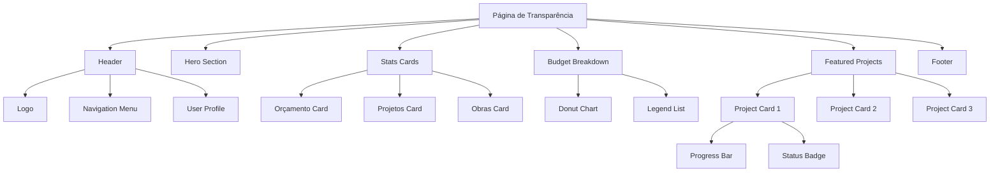
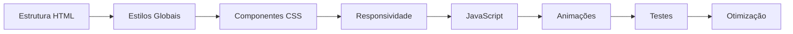

# Plano de Implementação: Página de Transparência

## 📋 Visão Geral

Implementar a "Página de Transparência" do JADUC baseada no design do Figma, seguindo os mesmos padrões de código, semântica e estilo da "Página de Login e Cadastro" existente.

## 🎯 Objetivos

- Criar uma página responsiva e acessível para exibir informações de transparência pública
- Manter consistência visual e técnica com o projeto existente
- Implementar animações e interatividade atraentes
- Garantir responsividade em todos os dispositivos

## 📊 Análise do Design Figma

### Componentes Principais Identificados:

1. **Header/Navegação Superior**
   - Logo JADUC (esquerda)
   - Menu de navegação: Comunidade, Transparência (ativo), Notícias
   - Informações do usuário e localização (direita)
   - Ícone de menu hambúrguer (mobile)

2. **Hero Section**
   - Título principal: "Portal de Transparência"
   - Subtítulo: "Orçamento Destinado"
   - Descrição: "Entenda de forma simples como dinheiro público é investido em Pimentas, Guarulhos - SP"

3. **Cards de Estatísticas (3 cards)**
   - **Card 1 (Azul)**: Orçamento Destinado - R$ 15 MI
   - **Card 2 (Branco)**: Projetos Ativos - 8
   - **Card 3 (Branco)**: Obras Atrasadas - 1

4. **Seção: "Como o dinheiro é divido?"**
   - Gráfico de rosca (donut chart) com 5 categorias:
     - Saúde (35%) - Azul escuro
     - Educação (25%) - Azul médio
     - Infraestrutura (20%) - Azul claro
     - Segurança (10%) - Marrom
     - Outros (10%) - Bege
   - Legenda com descrições detalhadas

5. **Seção: "Projetos em Destaque na Região"**
   - 3 cards de projetos com:
     - Nome do projeto
     - Barra de progresso visual
     - Porcentagem de conclusão
     - Status (Em andamento/Atrasado/Concluído)

6. **Footer**
   - Barra inferior simples

## 🎨 Paleta de Cores (do Design)

```css
--bg-page: #f8ede5           /* Fundo bege claro */
--primary-dark: #016180      /* Azul escuro principal */
--primary-blue: #003d5c      /* Azul muito escuro */
--accent-blue: #4a8cb0       /* Azul médio/claro */
--teal-light: #9ecdc9        /* Verde-azulado claro */
--brown-dark: #4c2c17        /* Marrom escuro (textos) */
--brown-medium: #8c5c47      /* Marrom médio */
--white: #ffffff             /* Branco */
```

## 📁 Estrutura de Arquivos

```
Jaduc/
└── Página de Transparência/
    ├── index.html           # Estrutura HTML principal
    ├── style.css            # Estilos específicos da página
    ├── globals.css          # Estilos globais (reutilizar do Login)
    ├── script.js            # Interatividade e animações
    └── assets/              # SVGs e imagens específicas (se necessário)
```

## 🏗️ Estrutura HTML Semântica

```html
<!DOCTYPE html>
<html lang="pt-BR">
<head>
    <!-- Meta tags, título, links CSS -->
</head>
<body>
    <!-- Header com navegação -->
    <header class="main-header">
        <nav class="navbar">
            <!-- Logo, menu, usuário -->
        </nav>
    </header>

    <!-- Conteúdo principal -->
    <main class="transparency-page">
        <!-- Hero Section -->
        <section class="hero-section">
            <!-- Títulos e descrição -->
        </section>

        <!-- Cards de Estatísticas -->
        <section class="stats-cards">
            <!-- 3 cards: Orçamento, Projetos, Obras -->
        </section>

        <!-- Divisão do Orçamento -->
        <section class="budget-breakdown">
            <div class="donut-chart-container">
                <!-- Gráfico de rosca SVG/CSS -->
            </div>
        </section>

        <!-- Projetos em Destaque -->
        <section class="featured-projects">
            <!-- Cards de projetos com barras de progresso -->
        </section>
    </main>

    <!-- Footer -->
    <footer class="main-footer">
        <!-- Informações do rodapé -->
    </footer>

    <script src="script.js"></script>
</body>
</html>
```

## 🎭 Componentes e Funcionalidades

### 1. Header Navegação
- **Elementos**: Logo, links de navegação, perfil do usuário
- **Interatividade**: 
  - Hover nos links de navegação
  - Menu hambúrguer responsivo (mobile)
  - Dropdown do perfil do usuário
- **Animação**: Sublinhado animado no item ativo

### 2. Cards de Estatísticas
- **Layout**: Grid responsivo (3 colunas → 1 coluna no mobile)
- **Animações**:
  - Fade-in ao carregar a página (stagger effect)
  - Hover: elevação com sombra
  - Ícones animados
- **Variações**: Card azul (destaque) e cards brancos

### 3. Gráfico de Rosca (Donut Chart)
- **Implementação**: SVG com `stroke-dasharray` e `stroke-dashoffset`
- **Animação**: Preenchimento progressivo ao entrar no viewport
- **Interatividade**: 
  - Hover nos segmentos destaca a categoria
  - Tooltip com informações detalhadas
- **Legenda**: Lista com bullets coloridos e descrições

### 4. Cards de Projetos
- **Elementos**:
  - Título do projeto
  - Barra de progresso customizada
  - Badge de status (cores diferentes)
  - Porcentagem de conclusão
- **Animações**:
  - Barra de progresso anima ao entrar no viewport
  - Hover: leve escala e sombra
- **Estados**: Em andamento (verde), Atrasado (laranja), Concluído (azul escuro)

## 🎨 Estratégia de CSS

### Arquitetura CSS
```
globals.css          → Variáveis, reset, tipografia, utilitários
style.css            → Estilos específicos da página de transparência
```

### Metodologia
- **BEM-like naming**: `.component__element--modifier`
- **CSS Custom Properties**: Para cores, espaçamentos, transições
- **Mobile-first**: Media queries progressivas
- **Flexbox/Grid**: Layout moderno e responsivo

### Animações Planejadas

1. **Entrada da Página**
   - Fade-in + slide-up nos elementos principais
   - Stagger effect nos cards (delay progressivo)

2. **Gráfico de Rosca**
   - Animação de preenchimento circular (0% → 100%)
   - Duração: 1.5s com easing suave

3. **Barras de Progresso**
   - Preenchimento da esquerda para direita
   - Intersection Observer para trigger

4. **Hover Effects**
   - Cards: `transform: translateY(-4px)` + sombra
   - Botões: Mudança de cor suave
   - Links: Sublinhado animado

## 📱 Responsividade

### Breakpoints
```css
/* Desktop: 1920px (design base) */
/* Laptop: 1280px - 1440px */
@media (max-width: 1280px) { /* Ajustes de espaçamento */ }

/* Tablet: 768px - 1024px */
@media (max-width: 1024px) { 
    /* Grid 2 colunas, fonte menor */
}

/* Mobile: 320px - 767px */
@media (max-width: 767px) { 
    /* Stack vertical, menu hambúrguer */
}
```

### Adaptações Mobile
- Header: Menu hambúrguer, logo centralizado
- Cards: Stack vertical (1 coluna)
- Gráfico: Tamanho reduzido, legenda abaixo
- Projetos: Cards full-width
- Tipografia: Escala reduzida (16px base → 14px)

## 🔧 JavaScript Funcionalidades

### 1. Animação do Gráfico de Rosca
```javascript
// Intersection Observer para animar quando visível
const animateDonutChart = (entries, observer) => {
    entries.forEach(entry => {
        if (entry.isIntersecting) {
            // Animar stroke-dashoffset de cada segmento
        }
    });
};
```

### 2. Barras de Progresso
```javascript
// Animar preenchimento das barras
const animateProgressBars = () => {
    document.querySelectorAll('.progress-bar').forEach(bar => {
        const targetWidth = bar.dataset.progress;
        // Animar width de 0 → targetWidth
    });
};
```

### 3. Menu Responsivo
```javascript
// Toggle menu hambúrguer
const toggleMobileMenu = () => {
    const menu = document.querySelector('.mobile-menu');
    menu.classList.toggle('is-open');
};
```

### 4. Tooltips Interativos
```javascript
// Mostrar informações ao hover nos segmentos do gráfico
const showTooltip = (event, data) => {
    // Posicionar e exibir tooltip com dados da categoria
};
```

## ♿ Acessibilidade

### Práticas Implementadas
- **Semântica HTML5**: `<header>`, `<nav>`, `<main>`, `<section>`, `<footer>`
- **ARIA labels**: Para ícones e elementos interativos
- **Contraste**: Mínimo 4.5:1 para textos
- **Foco visível**: Outline customizado para navegação por teclado
- **Alt text**: Descrições para imagens e gráficos
- **Screen reader**: Textos alternativos para dados visuais

## 🎯 Diferenciais e Melhorias

### Além do Design Base
1. **Micro-interações**:
   - Números contadores animados (count-up effect)
   - Partículas sutis no fundo
   - Parallax leve no scroll

2. **Performance**:
   - Lazy loading de imagens
   - CSS otimizado (sem Tailwind, CSS puro)
   - JavaScript modular e eficiente

3. **UX Enhancements**:
   - Loading states para dados dinâmicos
   - Skeleton screens
   - Smooth scroll entre seções
   - Feedback visual em todas as interações

## 📐 Diagrama de Componentes



## 🔄 Fluxo de Implementação



## ✅ Checklist de Qualidade

### HTML
- [ ] Semântica correta
- [ ] Atributos ARIA apropriados
- [ ] Meta tags completas
- [ ] Validação W3C

### CSS
- [ ] Variáveis CSS organizadas
- [ ] Nomenclatura consistente
- [ ] Responsivo em todos os breakpoints
- [ ] Animações suaves (60fps)
- [ ] Sem CSS não utilizado

### JavaScript
- [ ] Código modular e limpo
- [ ] Event listeners otimizados
- [ ] Sem memory leaks
- [ ] Compatibilidade cross-browser

### Performance
- [ ] Lighthouse Score > 90
- [ ] First Contentful Paint < 1.5s
- [ ] Time to Interactive < 3s
- [ ] Imagens otimizadas

### Acessibilidade
- [ ] WCAG 2.1 AA compliant
- [ ] Navegação por teclado funcional
- [ ] Screen reader friendly
- [ ] Contraste adequado

## 🚀 Próximos Passos

1. **Revisar e aprovar este plano** com o solicitante
2. **Coletar feedback** sobre funcionalidades adicionais
3. **Confirmar assets** necessários (SVGs, ícones)
4. **Iniciar implementação** seguindo a ordem do checklist
5. **Testes iterativos** durante o desenvolvimento

## 📝 Notas Técnicas

### Reutilização de Código
- Aproveitar [`globals.css`](Jaduc/Página de Login e Cadastro/globals.css:1) da página de Login
- Adaptar padrões de animação do [`style.css`](Jaduc/Página de Login e Cadastro/style.css:1) existente
- Manter consistência com [`script.js`](Jaduc/Página de Login e Cadastro/script.js:1) patterns

### Considerações Especiais
- **Gráfico de Rosca**: Implementar com SVG puro (sem bibliotecas) para manter leveza
- **Dados Dinâmicos**: Preparar estrutura para futura integração com API
- **Animações**: Usar `requestAnimationFrame` para performance
- **Ícones**: Inline SVG para melhor controle e performance

---

**Documento criado em**: 2026-09-14  
**Versão**: 1.0  
**Status**: Aguardando aprovação
