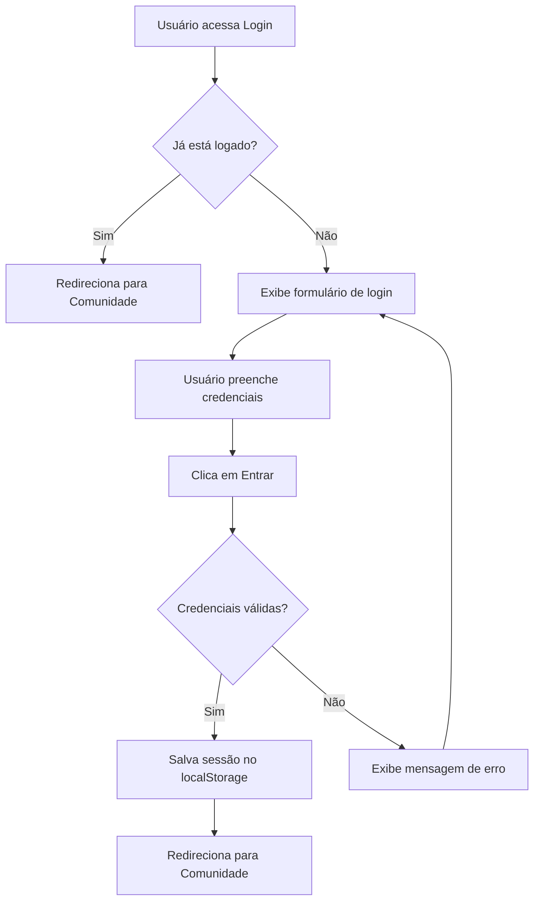
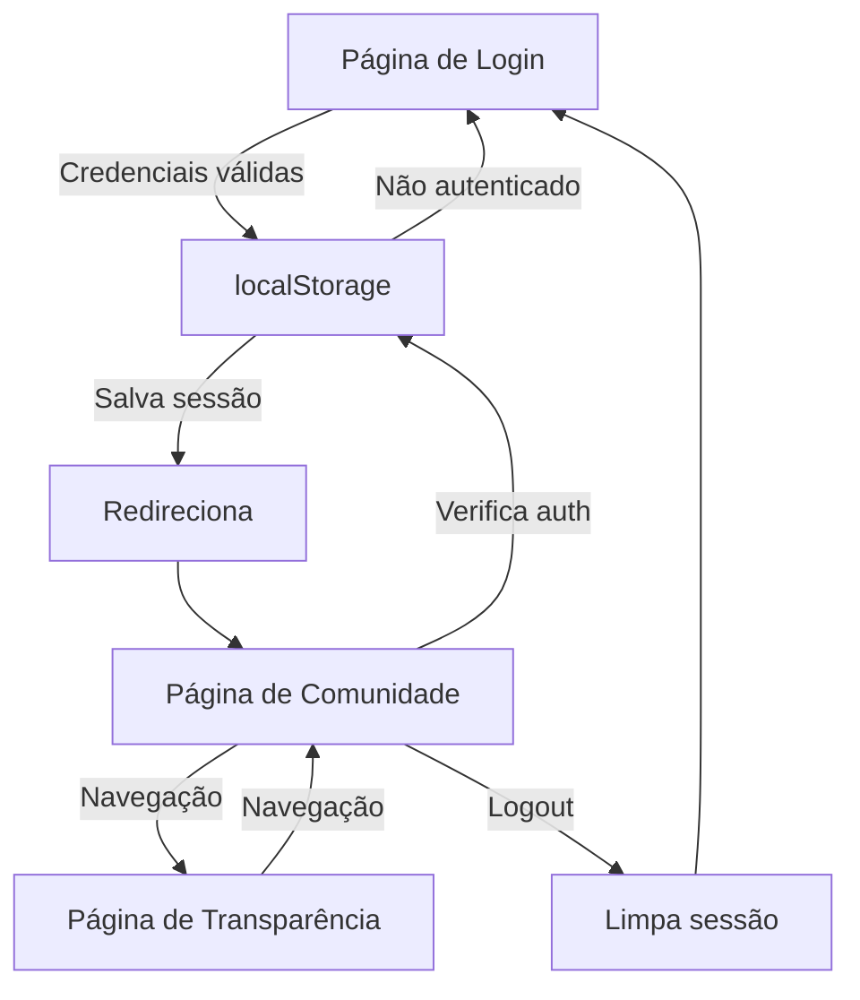

# Plano de Implementação: Página de Comunidade + Integração de Login

## 📋 Visão Geral

Criar a **Página de Comunidade** do JADUC com feed social interativo e implementar o sistema de autenticação que redireciona usuários logados da página de login para a comunidade. Manter consistência total com as páginas existentes (Transparência e Login).

## 🎯 Objetivos Principais

1. **Página de Comunidade Completa**
   - Feed de posts da comunidade local
   - Sistema de filtros por categoria
   - Interações sociais (curtir, comentar)
   - Design responsivo e acessível

2. **Sistema de Autenticação**
   - Validação de credenciais no login
   - Redirecionamento automático para comunidade
   - Persistência de sessão
   - Navegação entre páginas autenticadas

3. **Consistência Visual**
   - Reutilizar componentes e estilos
   - Manter paleta de cores e tipografia
   - Header compartilhado entre páginas

## 📊 Análise do Design Figma

### Componentes Identificados:

#### 1. **Header Compartilhado** (Reutilizável)
- Logo JADUC (esquerda)
- Navegação: **Comunidade** (ativo), Transparência, Notícias
- Localização e perfil do usuário (direita)
- Menu hambúrguer (mobile)

#### 2. **Hero/Subtitle Section**
- Texto: "Conecte-se com seus vizinhos em **Pimentas, Guarulhos - SP**"
- Tipografia: Palanquin Regular + Bold

#### 3. **Filtros de Categoria**
- **Todas as ações** (ativo - azul)
- Meu Bairro (branco)
- Voluntariados (branco)
- Debates (branco)
- Estilo: Pills/badges com sombra

#### 4. **Post Card** (Componente Repetível)
Estrutura de cada post:
- **Avatar do usuário** (círculo com inicial "U")
- **Nome**: "Usuario"
- **Localização**: "Bairro, Cidade - Estado"
- **Timestamp**: "0 segundos atrás"
- **Título**: "Ação, Atitude, Assunto"
- **Conteúdo**: Texto com preview e "Leia mais"
- **Badge de categoria**: "voluntariado" ou "Debate"
- **Interações**:
  - 👍 Curtir (contador)
  - 💬 Comentar (contador)
- **Separador** horizontal entre posts

#### 5. **Footer**
- Esquerda: "Coletividade • Transparência • Educação"
- Direita: "© 2026 Portal Jaduc - Direitos Protegidos"

## 🎨 Paleta de Cores (Consistente)

```css
/* Cores do Projeto JADUC */
--bg-page: #f8ede5           /* Fundo bege */
--primary-blue: #003d5c      /* Azul escuro */
--primary-dark: #016180      /* Azul principal */
--accent-blue: #4a8cb0       /* Azul claro */
--teal-light: #9ecdc9        /* Verde-azulado */
--brown-dark: #4c2c17        /* Marrom escuro */
--brown-medium: #8c5c47      /* Marrom médio */
--brown-light: #a17a6a       /* Marrom claro (filtros inativos) */
--white: #ffffff             /* Branco */
```

## 📁 Estrutura de Arquivos

```
Jaduc/
├── Página de Login e Cadastro/
│   ├── index.html           # ATUALIZAR: adicionar lógica de redirecionamento
│   ├── script.js            # ATUALIZAR: validação e redirect
│   └── ...
│
├── Página de Comunidade/    # NOVA PASTA
│   ├── index.html           # Estrutura da página
│   ├── globals.css          # Estilos globais (copiar e adaptar)
│   ├── style.css            # Estilos específicos
│   ├── script.js            # Interatividade do feed
│   └── README.md            # Documentação
│
├── Página de Transparência/
│   └── ...
│
└── shared/                  # NOVA PASTA (opcional)
    ├── header.css           # Estilos do header compartilhado
    └── auth.js              # Utilitários de autenticação
```

## 🔐 Sistema de Autenticação

### Fluxo de Autenticação



### Implementação Técnica

#### 1. **localStorage para Sessão**
```javascript
// Estrutura de dados do usuário
const userData = {
    isAuthenticated: true,
    username: "Usuario",
    location: "Pimentas, Guarulhos - SP",
    loginTime: Date.now()
};

// Salvar sessão
localStorage.setItem('jaducUser', JSON.stringify(userData));

// Verificar sessão
const user = JSON.parse(localStorage.getItem('jaducUser'));
```

#### 2. **Validação de Credenciais** (Simulada)
```javascript
// Para demonstração - em produção, usar API backend
const validCredentials = {
    email: "usuario@jaduc.com",
    password: "jaduc2026"
};

function validateLogin(email, password) {
    return email === validCredentials.email && 
           password === validCredentials.password;
}
```

#### 3. **Redirecionamento Automático**
```javascript
// No script.js da página de login
window.addEventListener('DOMContentLoaded', () => {
    const user = JSON.parse(localStorage.getItem('jaducUser'));
    
    if (user && user.isAuthenticated) {
        // Redirecionar para comunidade
        window.location.href = '../Página de Comunidade/index.html';
    }
});
```

#### 4. **Proteção de Páginas Autenticadas**
```javascript
// No script.js da página de comunidade
function checkAuthentication() {
    const user = JSON.parse(localStorage.getItem('jaducUser'));
    
    if (!user || !user.isAuthenticated) {
        // Redirecionar para login
        window.location.href = '../Página de Login e Cadastro/index.html';
    }
}

checkAuthentication();
```

## 🏗️ Estrutura HTML da Página de Comunidade

```html
<!DOCTYPE html>
<html lang="pt-BR">
<head>
    <meta charset="utf-8">
    <meta name="viewport" content="width=device-width, initial-scale=1.0">
    <title>JADUC | Comunidade</title>
    <link rel="stylesheet" href="globals.css">
    <link rel="stylesheet" href="style.css">
</head>
<body>
    <!-- Header Compartilhado -->
    <header class="main-header">
        <!-- Logo, navegação, perfil -->
    </header>

    <!-- Conteúdo Principal -->
    <main class="community-page">
        <!-- Hero/Subtitle -->
        <section class="hero-section">
            <p>Conecte-se com seus vizinhos em <strong>Pimentas, Guarulhos - SP</strong></p>
        </section>

        <!-- Filtros -->
        <section class="filters-section">
            <button class="filter-btn filter-btn--active">Todas as ações</button>
            <button class="filter-btn">Meu Bairro</button>
            <button class="filter-btn">Voluntariados</button>
            <button class="filter-btn">Debates</button>
        </section>

        <!-- Feed de Posts -->
        <section class="feed-section">
            <article class="post-card">
                <!-- Avatar, nome, localização, timestamp -->
                <!-- Título, conteúdo, badge -->
                <!-- Botões de interação -->
            </article>
            <!-- Mais posts... -->
        </section>
    </main>

    <!-- Footer -->
    <footer class="main-footer">
        <!-- Informações do rodapé -->
    </footer>

    <script src="script.js"></script>
</body>
</html>
```

## 🎭 Componentes CSS

### 1. **Post Card**
```css
.post-card {
    background: white;
    border: 2px solid var(--teal-light);
    border-radius: var(--radius-card);
    padding: 32px;
    margin-bottom: 24px;
    transition: all 0.3s ease;
}

.post-card:hover {
    transform: translateY(-4px);
    box-shadow: var(--shadow-lg);
}
```

### 2. **Filtros**
```css
.filter-btn {
    padding: 12px 28px;
    border-radius: 30px;
    font-family: var(--font-body);
    font-size: 24px;
    background: white;
    color: var(--brown-light);
    box-shadow: var(--shadow-sm);
    transition: all 0.3s ease;
}

.filter-btn--active {
    background: var(--primary-dark);
    color: white;
}
```

### 3. **Avatar do Usuário**
```css
.user-avatar {
    width: 68px;
    height: 68px;
    border-radius: 50%;
    background: var(--teal-light);
    display: flex;
    align-items: center;
    justify-content: center;
    font-family: var(--font-title);
    font-size: 40px;
    font-weight: 600;
    color: var(--accent-blue);
}
```

### 4. **Badge de Categoria**
```css
.category-badge {
    display: inline-block;
    padding: 8px 24px;
    border-radius: 30px;
    background: var(--bg-page);
    color: var(--accent-blue);
    font-family: var(--font-body);
    font-size: 32px;
    box-shadow: inset 0 4px 4px rgba(0,0,0,0.25);
}
```

## 🔧 Funcionalidades JavaScript

### 1. **Sistema de Filtros**
```javascript
function initFilters() {
    const filterButtons = document.querySelectorAll('.filter-btn');
    const posts = document.querySelectorAll('.post-card');
    
    filterButtons.forEach(btn => {
        btn.addEventListener('click', () => {
            // Remover active de todos
            filterButtons.forEach(b => b.classList.remove('filter-btn--active'));
            // Adicionar active no clicado
            btn.classList.add('filter-btn--active');
            
            // Filtrar posts
            const filter = btn.dataset.filter;
            filterPosts(filter, posts);
        });
    });
}
```

### 2. **Curtir e Comentar**
```javascript
function initInteractions() {
    const likeButtons = document.querySelectorAll('.like-btn');
    const commentButtons = document.querySelectorAll('.comment-btn');
    
    likeButtons.forEach(btn => {
        btn.addEventListener('click', () => {
            const counter = btn.querySelector('.like-count');
            const currentCount = parseInt(counter.textContent);
            
            if (btn.classList.contains('liked')) {
                counter.textContent = currentCount - 1;
                btn.classList.remove('liked');
            } else {
                counter.textContent = currentCount + 1;
                btn.classList.add('liked');
            }
        });
    });
}
```

### 3. **Expandir/Recolher Post**
```javascript
function initReadMore() {
    const readMoreButtons = document.querySelectorAll('.read-more-btn');
    
    readMoreButtons.forEach(btn => {
        btn.addEventListener('click', () => {
            const content = btn.previousElementSibling;
            
            if (content.classList.contains('expanded')) {
                content.classList.remove('expanded');
                btn.textContent = 'Leia mais';
            } else {
                content.classList.add('expanded');
                btn.textContent = 'Leia menos';
            }
        });
    });
}
```

### 4. **Atualização de Timestamp**
```javascript
function updateTimestamps() {
    const timestamps = document.querySelectorAll('.post-timestamp');
    
    timestamps.forEach(timestamp => {
        const postTime = new Date(timestamp.dataset.time);
        const now = new Date();
        const diff = Math.floor((now - postTime) / 1000); // segundos
        
        timestamp.textContent = formatTimeDiff(diff);
    });
}

function formatTimeDiff(seconds) {
    if (seconds < 60) return `${seconds} segundos atrás`;
    if (seconds < 3600) return `${Math.floor(seconds/60)} minutos atrás`;
    if (seconds < 86400) return `${Math.floor(seconds/3600)} horas atrás`;
    return `${Math.floor(seconds/86400)} dias atrás`;
}

// Atualizar a cada 30 segundos
setInterval(updateTimestamps, 30000);
```

## 📱 Responsividade

### Breakpoints
```css
/* Desktop: 1600px (padrão) */

/* Laptop: 1440px */
@media (max-width: 1440px) {
    .post-card { padding: 28px; }
    .filter-btn { font-size: 22px; }
}

/* Tablet: 1024px */
@media (max-width: 1024px) {
    .filters-section {
        flex-wrap: wrap;
        gap: 12px;
    }
    .post-card { padding: 24px; }
}

/* Mobile: 768px */
@media (max-width: 768px) {
    .filters-section {
        flex-direction: column;
    }
    .filter-btn {
        width: 100%;
        font-size: 18px;
    }
    .post-card {
        padding: 20px;
    }
    .user-avatar {
        width: 50px;
        height: 50px;
        font-size: 28px;
    }
}
```

## 🔄 Navegação Entre Páginas

### Estrutura de Links

```html
<!-- No header de todas as páginas -->
<nav class="main-nav">
    <a href="../Página de Comunidade/index.html" class="nav-item">
        
        <span>Comunidade</span>
    </a>
    
    <a href="../Página de Transparência/index.html" class="nav-item">
        
        <span>Transparência</span>
    </a>
    
    <a href="#" class="nav-item">
        <svg><!-- Ícone de notícias --></svg>
        <span>Notícias</span>
    </a>
</nav>
```

### Logout
```javascript
function logout() {
    localStorage.removeItem('jaducUser');
    window.location.href = '../Página de Login e Cadastro/index.html';
}

// Adicionar botão de logout no menu do usuário
document.querySelector('.user-menu-logout').addEventListener('click', logout);
```

## ♿ Acessibilidade

### Práticas Implementadas
- ✅ Semântica HTML5 (`<article>`, `<section>`, `<nav>`)
- ✅ ARIA labels para botões de interação
- ✅ Alt text para avatares e ícones
- ✅ Contraste adequado (WCAG AA)
- ✅ Navegação por teclado
- ✅ Focus visível em elementos interativos
- ✅ Screen reader friendly

## 🎯 Animações e Micro-interações

### 1. **Entrada dos Posts**
```css
@keyframes slideInUp {
    from {
        opacity: 0;
        transform: translateY(30px);
    }
    to {
        opacity: 1;
        transform: translateY(0);
    }
}

.post-card {
    animation: slideInUp 0.5s ease backwards;
}

.post-card:nth-child(1) { animation-delay: 0.1s; }
.post-card:nth-child(2) { animation-delay: 0.2s; }
.post-card:nth-child(3) { animation-delay: 0.3s; }
```

### 2. **Feedback de Curtida**
```css
.like-btn.liked {
    animation: heartBeat 0.5s ease;
}

@keyframes heartBeat {
    0%, 100% { transform: scale(1); }
    25% { transform: scale(1.3); }
    50% { transform: scale(1.1); }
}
```

### 3. **Transição de Filtros**
```css
.filter-btn {
    transition: all 0.3s cubic-bezier(0.4, 0, 0.2, 1);
}

.filter-btn:hover {
    transform: translateY(-2px);
    box-shadow: 0 6px 16px rgba(0,0,0,0.15);
}
```

## 📝 Atualizações na Página de Login

### Modificações Necessárias

#### 1. **HTML** - Adicionar data attributes
```html
<form class="login-form" id="login-form" autocomplete="on">
    <div class="form-group">
        <label for="login-email">Email</label>
        <input type="email" id="login-email" name="email" 
               class="input-field" placeholder="Digite seu email" 
               required autocomplete="email">
    </div>
    
    <div class="form-group">
        <label for="login-password">Senha</label>
        <input type="password" id="login-password" name="password" 
               class="input-field" placeholder="Digite sua senha" 
               required autocomplete="current-password">
    </div>
    
    <!-- Mensagem de erro -->
    <div class="error-message" id="error-message" style="display: none;">
        Email ou senha incorretos. Tente novamente.
    </div>
    
    <button type="submit" class="btn-primary">
        <!-- Conteúdo do botão -->
    </button>
</form>
```

#### 2. **JavaScript** - Adicionar lógica de autenticação
```javascript
// Verificar se já está logado ao carregar a página
window.addEventListener('DOMContentLoaded', () => {
    const user = JSON.parse(localStorage.getItem('jaducUser'));
    
    if (user && user.isAuthenticated) {
        window.location.href = '../Página de Comunidade/index.html';
    }
});

// Processar login
document.getElementById('login-form').addEventListener('submit', (e) => {
    e.preventDefault();
    
    const email = document.getElementById('login-email').value;
    const password = document.getElementById('login-password').value;
    
    // Validação (simulada - em produção usar API)
    if (email === 'usuario@jaduc.com' && password === 'jaduc2026') {
        // Login bem-sucedido
        const userData = {
            isAuthenticated: true,
            username: 'Usuario',
            email: email,
            location: 'Pimentas, Guarulhos - SP',
            loginTime: Date.now()
        };
        
        localStorage.setItem('jaducUser', JSON.stringify(userData));
        
        // Redirecionar para comunidade
        window.location.href = '../Página de Comunidade/index.html';
    } else {
        // Mostrar erro
        const errorMsg = document.getElementById('error-message');
        errorMsg.style.display = 'block';
        errorMsg.style.animation = 'shake 0.5s ease';
        
        setTimeout(() => {
            errorMsg.style.display = 'none';
        }, 3000);
    }
});
```

#### 3. **CSS** - Estilo da mensagem de erro
```css
.error-message {
    background-color: #ff4444;
    color: white;
    padding: 12px 20px;
    border-radius: 12px;
    margin: 12px 0;
    font-family: var(--font-body);
    font-size: 14px;
    text-align: center;
}

@keyframes shake {
    0%, 100% { transform: translateX(0); }
    25% { transform: translateX(-10px); }
    75% { transform: translateX(10px); }
}
```

## 🧪 Testes e Validação

### Checklist de Testes

#### Funcionalidade
- [ ] Login com credenciais corretas redireciona para comunidade
- [ ] Login com credenciais incorretas exibe erro
- [ ] Usuário logado não pode acessar página de login
- [ ] Usuário não logado não pode acessar comunidade
- [ ] Filtros funcionam corretamente
- [ ] Curtir/descurtir atualiza contador
- [ ] "Leia mais" expande/recolhe conteúdo
- [ ] Navegação entre páginas funciona
- [ ] Logout limpa sessão e redireciona

#### Responsividade
- [ ] Desktop (1600px+): Layout completo
- [ ] Laptop (1440px): Ajustes proporcionais
- [ ] Tablet (1024px): Grid adaptado
- [ ] Mobile (768px): Stack vertical
- [ ] Mobile pequeno (480px): Otimizado

#### Acessibilidade
- [ ] Navegação por teclado funcional
- [ ] Screen reader identifica elementos
- [ ] Contraste adequado (WCAG AA)
- [ ] Focus visível em todos os elementos
- [ ] ARIA labels apropriados

## 📚 Documentação de Uso

### Credenciais de Teste
```
Email: usuario@jaduc.com
Senha: jaduc2026
```

### Fluxo de Uso
1. Acesse a página de login
2. Insira as credenciais de teste
3. Clique em "Entrar na comunidade"
4. Será redirecionado para a página de comunidade
5. Navegue entre Comunidade e Transparência
6. Use os filtros para ver diferentes tipos de posts
7. Interaja com curtidas e comentários

## 🚀 Próximos Passos (Futuro)

### Melhorias Sugeridas
- [ ] Integração com backend real (API REST)
- [ ] Sistema de comentários completo
- [ ] Upload de imagens nos posts
- [ ] Notificações em tempo real
- [ ] Sistema de mensagens diretas
- [ ] Perfil de usuário editável
- [ ] Busca de posts e usuários
- [ ] Moderação de conteúdo
- [ ] Gamificação (badges, pontos)
- [ ] PWA (Progressive Web App)

## 📐 Diagrama de Arquitetura



## ✅ Checklist de Implementação

### Fase 1: Estrutura Base
- [ ] Criar pasta "Página de Comunidade"
- [ ] Copiar e adaptar globals.css
- [ ] Criar estrutura HTML completa
- [ ] Implementar header compartilhado

### Fase 2: Estilos
- [ ] Estilizar hero section
- [ ] Criar componente de filtros
- [ ] Estilizar post cards
- [ ] Implementar badges e avatares
- [ ] Adicionar responsividade

### Fase 3: Interatividade
- [ ] Sistema de filtros
- [ ] Curtir/comentar
- [ ] Expandir/recolher posts
- [ ] Timestamps dinâmicos

### Fase 4: Autenticação
- [ ] Atualizar página de login
- [ ] Implementar validação
- [ ] Sistema de redirecionamento
- [ ] Proteção de rotas
- [ ] Logout funcional

### Fase 5: Testes e Documentação
- [ ] Testar todos os fluxos
- [ ] Validar responsividade
- [ ] Verificar acessibilidade
- [ ] Criar README.md
- [ ] Documentar credenciais de teste

---

**Documento criado em**: 2026-09-14  
**Versão**: 1.0  
**Status**: Pronto para implementação
